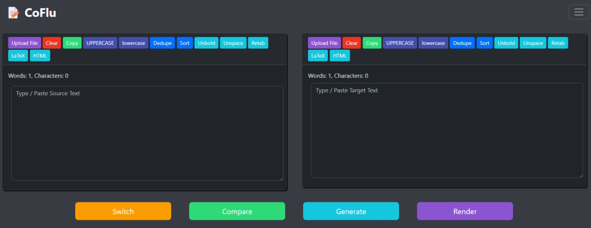

# CoFlu

CoFlu is a comprehensive text manipulation, generation, and comparison tool designed to be your one-stop solution for a wide range of text-related tasks. It empowers users to compare texts, generate content using cutting-edge AI models, transform text in various ways, transcribe audio, and even translate documents with unprecedented accuracy and layout preservation. CoFlu is particularly useful for proofreading, editing, content creation, version control, and ensuring consistency across different text versions.

**As of February 2025, CoFlu is the *only* website in the world offering Microsoft Word (.docx) translation with full layout preservation while leveraging the power of Large Language Models (LLMs) for superior translation quality.** This feature alone sets CoFlu apart, providing a powerful and unique capability for users working with formatted documents.

## Features

**Core Functionality:**

*   **File Upload:** Import text from a variety of file formats: `.epub`, `.txt`, `.html`, `.htm`, `.css`, `.xml`, `.json`, and, crucially, `.docx`.
*   **Text Comparison:** Analyze the differences between two texts using the Levenshtein distance algorithm, calculate percentage differences, and provide visual diff views. Includes an optional "semantic cleanup" for more meaningful comparisons.
*   **Diff Views:** Visualize differences in either a single-column format (with insertions and deletions highlighted) or a double-column format for side-by-side comparison.
*   **Text Transformation:** A comprehensive suite of text manipulation tools:
    *   Convert to uppercase or lowercase.
    *   Deduplicate lines.
    *   Sort lines (alphabetically, both for entire lines and space-separated words within a single line).
    *   Remove bold formatting.
    *   Remove extra spaces.
    *   Format LaTeX code (specifically, handling common spacing issues around delimiters).
    *   Format HTML (e.g., replacing `&nbsp;` with regular spaces).
    *   Retab: Consistently convert spaces to tabs for indentation, addressing inconsistencies in code or text.
*   **Markdown Rendering:** Render Markdown content to HTML, with full support for mathematical expressions using either KaTeX or MathJax. A print/save feature (Ctrl+P) allows you to easily capture the rendered output.

**AI-Powered Capabilities:**

*   **AI Text Generation:** Generate high-quality text using a selection of leading AI models:
    *   **OpenAI's ChatGPT:** Including the latest `gpt-4o` and `o3-mini` models.
    *   **Anthropic's Claude:** Leveraging the `claude-3.5-sonnet` and `claude-3.5-haiku` models.
    *   **DeepSeek:** Featuring both R1 and V3.
    *   **Google's Gemini:** Access to multiple Gemini 2.0 models and the ability to use videos.
    *   **Groq's LLaMAs and Mixtral:** Utilizing Groq's high-speed inference for rapid text generation.
    *   **X's Grok:** Using the most preferred AI yet.
    *   **Qwen:** Including models like `qwen-max` and `qwen-vl-max`.
    *   **SambaNova's LLaMAs:** Including vision models.
*   **Customizable Prompts:** Use predefined prompts (e.g., "Proofread this text") or create and save your own custom prompts for repeated use.
*   **Streaming Support:** (Optional) Receive generated text as a stream, allowing you to see the output as it's being created (particularly useful for longer generations).
*   **Image and Video Input:** For models that support it, upload images or videos to provide visual context for your prompts.
*   **Audio Transcription:** Transcribe audio files (`.flac`, `.mp3`, `.mp4`, `.mpeg`, `.mpga`, `.m4a`, `.ogg`, `.wav`, `.webm`) into text using Groq's Whisper model. Supports multiple languages.
*   **Translation:** Translate text into a variety of languages using the selected AI model. This is a core part of the groundbreaking `.docx` translation feature.

**Groundbreaking .DOCX Translation:**

*   **Translate DOCX Files:** Upload Microsoft Word (`.docx`) documents for translation.
*   **Layout Preservation:** CoFlu meticulously preserves the original document's formatting, including fonts, styles, tables, and images. This is a *key differentiator* from simple text translators.
*   **LLM-Powered Translation:** Uses the selected AI model (ChatGPT, Claude, Gemini, Grok, Groq, Qwen, SambaNova) for high-quality, context-aware translation. This often surpasses the accuracy of traditional machine translation systems.
*   **Translation Batch Size:** Set the maximum size of the translation batch (smaller values may help prevent API errors).
*   **Translation Batch RPM:** Set the delay between batches (larger values may help prevent API errors).
*   **Exponential Retry:** Number of retries for failed requests.
*   **Download Translated DOCX:** After processing, download the fully translated `.docx` file, ready to use.

**User Experience & Customization:**

*   **Local Storage:** CoFlu saves your text, settings, and custom prompts locally in your browser's storage, so you don't lose your work.
*   **Appearance Customization:**
    *   Switch between light and dark modes.
    *   Toggle a "wide mode" for a more expansive layout.
*   **Settings Import/Export:** Import and export settings in JSON format.

## Usage

1.  **Load Text/Files:**
    *   Use the "Upload File" buttons to load text files (including `.docx`) into the source and target text areas.
    *   Alternatively, type or paste text directly into the text areas.

2.  **Text Transformation:**
    *   Use the buttons above each text area to apply transformations (uppercase, lowercase, dedupe, etc.).

3.  **AI Text Generation:**
    *   Select your desired API model (ChatGPT, Claude, Gemini, Groq, SambaNova, Qwen).
    *   Enter the corresponding API key (see the "API Keys" section below).
    *   Choose a predefined prompt or enter a custom prompt.
    *   (Optional) Upload images or videos if the selected model supports them.
    *   (Optional) Enable/disable streaming.
    *   Click "Generate" to produce text in the target text area.

4.  **Text Comparison:**
    *   Click "Compare" to analyze the differences between the source and target texts.
    *   View results, including Levenshtein distance, percentage differences, and visual diffs.

5.  **Switch Texts:**
    *   Click "Switch" to swap the contents of the source and target text areas.

6.  **Audio Transcription:**
    *   Select the target language for transcription.
    *   Upload an audio file.
    *   Click "Start Transcribe."

7.  **Markdown Rendering:**
    *   Click "Render" to convert Markdown in the text areas to HTML.
    *   Choose your preferred math renderer (KaTeX or MathJax).
    *   Use Ctrl+P to save the rendered target text.

8.  **.DOCX Translation:**
    *   Select the desired language.
    *   Upload the file.
    *   Click "Start Translation."

## Custom Prompts

1.  Enter your custom prompt in the "Custom Prompt" input.
2.  Click "Save Prompt" to store it for later use.
3.  Saved prompts will appear in the "Select Prompt" dropdown.

## API Keys

*   You need API keys to use the AI generation, transcription, and `.docx` translation features.
*   CoFlu supports API keys from:
    *   **OpenAI:** [OpenAI Platform](https://platform.openai.com/api-keys)
    *   **Anthropic:** [Anthropic Console](https://console.anthropic.com/settings/keys)
    *   **Google:** [Google AI Studio](https://aistudio.google.com/app/apikey)
    *   **Grok:** [xAI Cloud Console](https://console.x.ai)
    *   **Groq:** [GroqCloud](https://console.groq.com/keys)
    *   **Qwen:** [Qwen API](https://bailian.console.alibabacloud.com/?apiKey=1#/api-key)
    *   **SambaNova:** [SambaNova API](https://cloud.sambanova.ai/apis)

*   Enter your API keys in the "Settings" page. CoFlu stores them securely in your browser's local storage. **They are *not* sent to any external server.**

## Dependencies

- [Bootstrap](https://getbootstrap.com)
- [JSZip](https://github.com/Stuk/jszip)
- [KaTeX](https://katex.org)
- [MathJax](https://www.mathjax.org)
- [diff-match-patch](https://github.com/google/diff-match-patch)
- [marked](https://marked.js.org)

## Inspiration

- [Count Words Free - Compare Texts](https://countwordsfree.com/comparetexts)
- [EditGPT](https://editgpt.app)
- [Notability](https://notability.com)

## Bugs

- Not found yet.

## TODOs

- Add the No BS response prompt extension.
- Add Ollama local LLMs support to obtain independence.
- Add image drag-and-drop or paste (Ctrl+V for image data) into the image upload card.
- Bring audio support for ChatGPT, Gemini, SambaNova, and Qwen.
- Enable editing of custom prompts. When a custom prompt is selected, a text input field should reappear, similar to when adding a new custom prompt. Additionally, a delete button should be available.
- Extend document support to other formats, including PDFs, both for input and translation.
- Replace LaTeX punctuation inside separate text macros.
- Rewrite and refactor the entire codebase.
- Rewrite Gemini without Google Generative AI.

## License

This project is licensed under the MIT License. See the [LICENSE](LICENSE) file for details.